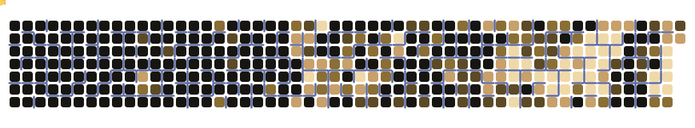

&nbsp;

&nbsp;

## About me

I'm an AI-native founder. I build products that earn their keep and the tools I wished existed, running as lean as possible. My focus right now is **Wend**, an AI relationship-intelligence graph, built under my studio **A14 Labs**.

## What I'm building

| Project | What it is | |
| :-- | :-- | :-- |
| **[Wend](https://trywend.io)** | A digital brain for the people in your life | Since May 2026 |
| **[Fintellect Learning](https://www.fintellectlearning.com)** | AI-native adaptive learning, APAC-first | Since Oct 2025 |
| **[A14 Labs](https://a14labs.co)** | My AI-native product studio | Since Oct 2025 |
| **[GlobalSVF](https://globalsvf.org)** | The full technical stack, as CTO | Since Sept 2025 |

## The chase

My contribution graph as a live Pac-Man game · regenerated daily

## Signals

## Connect

